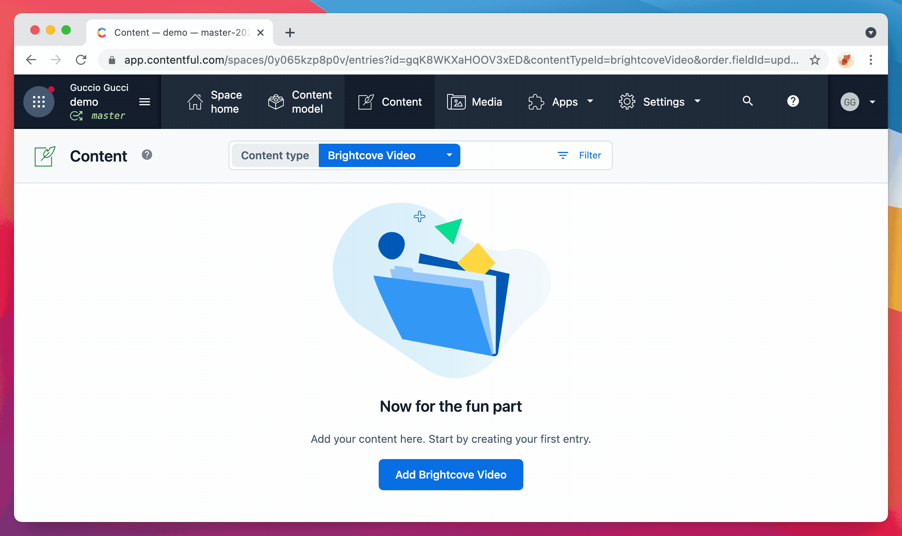
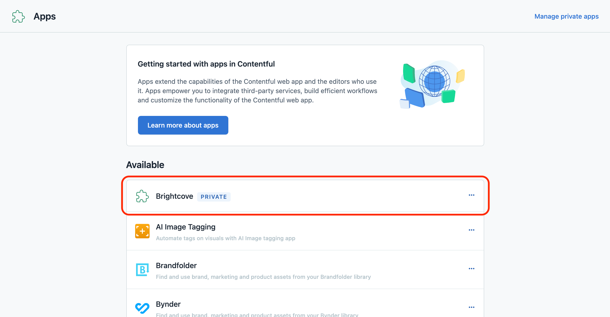
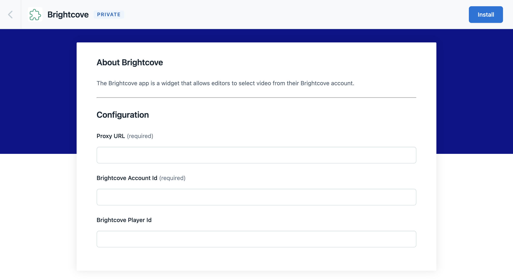
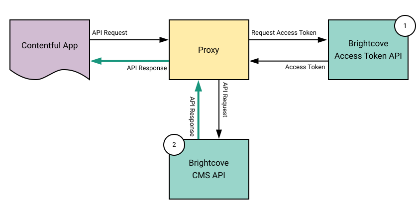

# Contentful App - Brightcove

## Setup

### Create an `AppDefinition`

First of all you need to create a new `AppDefinition`.

[Go the to the management view](https://app.contentful.com/deeplink?link=app-definition-list) for your apps.

Click on **Create an app** and you will be redirected to a page where you can provide details about your app.

1. Provide a name for your app. This can be whatever you want, we chose **Brightcove**.

1. Enter the app url. This should be set to https://gucciogucci.github.io/contentful-app-brightcove

1. Specify the app locations. Select **App configuration screen** and **Entry field - Short text**.

Click on **Create app** when you are done filling in the details.

### Install the app

After you created the `AppDefinition`, the app should appear on the app listing page in the list of available apps.

[Go to your app listing page](https://app.contentful.com/deeplink?link=apps)

Click on the app and authorize the access.

At this point you need to configure the application:

* **Proxy URL**: this is the url for your Brightcove Proxy. Read more on the next chapter.

* **Brightcove Account Id**: account id is used to display the video player in Contentful instead of the input text.

* **Brightcove Player Id**: you can choose a custom Brightcove Player instead of the default one.

Click the **Install** button to install your app.

### Use the app

The app is finally ready to be used!

Create a new content model (or use an already existing one) and add a new `short text` field.  
Click on `Create and configure`.

Selecting the `Appearance` tab you should be able to choose the new Brightcove app.  
Click on `Confirm`.

When you'll create a new Entry, you'll see the `Choose Video` button.

:tada:  You have done!

## Brightcove Proxy

### Introduction

The Brightcove Platform APIs are generally not CORS-enabled, meaning that you cannot access them directly from a web app.

To get around this, all you need to do is route the API requests through a server-side app often called a proxy.  
The proxy takes the request from a web page via JavaScript, gets an access token, makes the API request, and then returns the response to the calling page.

> source: *https://github.com/BrightcoveLearning/sample-proxy-apps*

### Examples

Checkout the [brightcove-proxy](./brightcove-proxy/) folder to understand how to build your own proxy.

## Development

This project was bootstrapped with [Create Contentful App](https://github.com/contentful/create-contentful-app).

### Available Scripts

In the project directory, you can run:

##### `npm start`

Creates or updates your app definition in Contentful, and runs the app in development mode.
Open your app to view it in the browser.

The page will reload if you make edits.
You will also see any lint errors in the console.

##### `npm run build`

Builds the app for production to the `build` folder.
It correctly bundles React in production mode and optimizes the build for the best performance.

The build is minified and the filenames include the hashes.
Your app is ready to be deployed!

### Libraries to use

To make your app look and feel like Contentful use the following libraries:

- [Forma 36](https://f36.contentful.com/) – Contentful's design system
- [Contentful Field Editors](https://www.contentful.com/developers/docs/extensibility/field-editors/) – Contentful's field editor React components

### Learn More

[Read more](https://www.contentful.com/developers/docs/extensibility/app-framework/create-contentful-app/) and check out the video on how to use the CLI.

Create Contentful App uses [Create React App](https://create-react-app.dev/). You can learn more in the [Create React App documentation](https://facebook.github.io/create-react-app/docs/getting-started) and how to further customize your app.

## License

Copyright 2021 Gucci.

Licensed under the [GNU Lesser General Public License, Version 3.0](http://www.gnu.org/licenses/lgpl.txt)